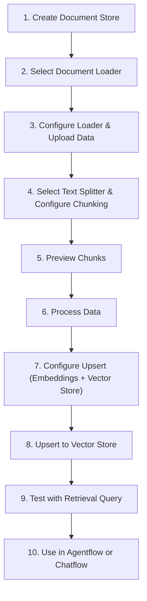

---

## 1. Introduction to Document Stores

Document Stores are a centralized data management system within FlowiseAI that enables you to upload, split, process, and prepare datasets for use in Retrieval Augmented Generation (RAG) workflows — all from a single location.

**Why Document Stores matter:**

Large Language Models (LLMs) are trained on general knowledge and have a fixed knowledge cutoff date. They are not aware of your proprietary data, internal documentation, or domain-specific content. Document Stores solve this by providing a structured pipeline to:

1. **Ingest** raw data from diverse sources (PDFs, websites, GitHub repositories, databases, etc.)
2. **Chunk** that data into semantically meaningful pieces
3. **Embed** those chunks as numerical vectors
4. **Upsert** them into a Vector Store for similarity-based retrieval

Without Document Stores, you would need to manually wire together separate nodes for loading, splitting, embedding, and upserting in every chatflow or agentflow. Document Stores centralize this pipeline so it can be reused across multiple flows. [1](#0-0) 

---

## 2. The Document Store Workflow

The end-to-end process for working with a Document Store follows these steps:



---

## 3. Step 1 — Creating a Document Store

Navigate to the **Document Stores** section in the Flowise sidebar and click **Add Document Store**. Provide a descriptive name that reflects the dataset it will contain (e.g., `"LibertyGuard Deluxe Homeowners Policy"`).

**Best Practice:** Use one Document Store per logical knowledge domain. Mixing unrelated datasets in a single store makes metadata filtering more complex and can reduce retrieval precision. [2](#0-1) 

---

## 4. Step 2 — Selecting a Document Loader

After creating the store, click into it and select a **Document Loader**. Document Loaders are specialized nodes that handle the ingestion of various document formats and data sources. [3](#0-2) 

### Available Document Loaders

FlowiseAI provides over 30 document loaders, covering a wide range of sources:

| Category | Loaders |
|---|---|
| **File-based** | PDF Files, Docx File, CSV File, Text File, JSON File, JSON Lines File, Microsoft Excel, Microsoft PowerPoint, Microsoft Word, Epub File, File (multi-format) |
| **Web / Scraping** | Cheerio Web Scraper, Playwright Web Scraper, Puppeteer Web Scraper, FireCrawl, Spider, Apify Website Content Crawler, BraveSearch Loader, SearchApi, SerpApi |
| **Code & Dev Platforms** | GitHub, GitBook, Confluence, Jira, Figma |
| **Cloud Storage** | Google Drive, Google Sheets, S3 File Loader, Airtable |
| **Productivity** | Notion (Page, Database, Folder) |
| **Custom / Advanced** | API Loader, Custom Document Loader, Unstructured File Loader, Unstructured Folder Loader, Folder with Files, Document Store (as a loader) | [4](#0-3) 

**Choosing the right loader:**
- For internal documents (PDFs, Word files): use **PDF Files**, **Docx File**, or the universal **File** loader
- For websites: use **Cheerio Web Scraper** (fast, static pages) or **Playwright/Puppeteer** (JavaScript-rendered pages)
- For code repositories: use **GitHub**
- For team wikis: use **Confluence**, **Notion**, or **GitBook**

---

## 5. Step 3 — Configuring the Document Loader

Each loader has its own required and optional parameters. Two parameters are **universal** across virtually all loaders:

### 5.1 Additional Metadata

**What it is:** A JSON object that allows you to inject custom key-value pairs into the metadata of every document chunk produced by this loader.

**Why it matters:** When multiple datasets are upserted into the same Vector Store index, metadata keys allow you to filter retrieval to only the relevant dataset. Without this, a query might return chunks from unrelated documents.

**Example:**
```json
{ "company": "liberty", "doc_type": "insurance_policy" }
```

This metadata is then embedded into every chunk, enabling downstream filtering like: *"retrieve only chunks where `company = liberty`"*.

**Recommended value:** Always add at least one unique identifier key (e.g., `source_dataset`, `company`, `project`) to every loader configuration. [5](#0-4) [6](#0-5) 

### 5.2 Omit Metadata Keys

**What it is:** A comma-separated list of metadata key names to remove from the default metadata that the loader automatically attaches to each document.

**Why it matters:** Loaders often attach verbose or irrelevant metadata (e.g., internal file paths, page numbers, raw timestamps). Removing unnecessary keys reduces the size of each stored chunk and keeps the metadata clean and purposeful.

**Example:** `"pdf_numpages, pdf_info, source"`

**Recommended value:** Review the default metadata produced by your loader (visible in the chunk preview) and omit any keys that are not useful for filtering or debugging.

**Special value:** Use `*` to remove **all** default metadata, keeping only what you explicitly add via Additional Metadata. [7](#0-6) 

---

## 6. GitHub Document Loader — Specific Options

The **GitHub Document Loader** is one of the most feature-rich loaders, designed to ingest entire code repositories or documentation trees. It exposes several advanced configuration options: [8](#0-7) 

### 6.1 Recursive

**What it is:** A boolean toggle (`true`/`false`) that controls whether the loader traverses subdirectories within the repository.

**Why it matters:** GitHub repositories are typically organized in nested folder structures. If `Recursive` is set to `false`, only files at the root level of the specified branch are loaded. Setting it to `true` ensures the entire repository tree is ingested.

**Recommended value:** `true` — for most use cases involving documentation or code repositories, you want to capture all files across all subdirectories. Set to `false` only if you intentionally want to limit ingestion to the root directory.

### 6.2 Max Concurrency

**What it is:** An integer that sets the maximum number of files that can be fetched from the GitHub API simultaneously.

**Why it matters:** GitHub enforces rate limits on API requests. Fetching too many files in parallel can trigger rate-limit errors (HTTP 429), causing the loader to fail. Conversely, setting this too low will make ingestion of large repositories very slow.

**Recommended value:** `2` to `5` for public repositories without authentication. With a GitHub Personal Access Token (which grants higher rate limits), values of `5` to `10` are reasonable. Start conservatively and increase if no rate-limit errors occur.

### 6.3 Github Base URL

**What it is:** A custom base URL for the GitHub web interface, used when connecting to a **GitHub Enterprise** instance instead of the public `github.com`.

**Why it matters:** Organizations running self-hosted GitHub Enterprise have a different domain (e.g., `https://github.mycompany.com`). Without specifying this, the loader defaults to `https://github.com` and will fail to resolve enterprise repository URLs.

**Recommended value:** Leave blank for public GitHub. For enterprise instances, set to your organization's GitHub domain, e.g., `https://github.mycompany.com`.

### 6.4 Github Instance API

**What it is:** A custom URL for the GitHub REST API endpoint, used alongside `Github Base URL` for enterprise instances.

**Why it matters:** The GitHub Enterprise API endpoint differs from the public API (`https://api.github.com`). Enterprise instances typically expose their API at `https://github.mycompany.com/api/v3`.

**Recommended value:** Leave blank for public GitHub. For enterprise, set to `https://github.mycompany.com/api/v3`.

### 6.5 Ignore Paths

**What it is:** An array of glob patterns specifying file paths or directories within the repository that should be excluded from loading.

**Why it matters:** Repositories often contain files that are irrelevant or harmful to include in a knowledge base — such as compiled binaries, test fixtures, auto-generated files, or large asset directories. Including these wastes storage and degrades retrieval quality.

**Example values:**
```json
["*.png", "*.jpg", "node_modules/**", "dist/**", "**/*.test.ts"]
```

**Recommended value:** At minimum, exclude binary files, image assets, and dependency directories. For a documentation repository, you might use `["**/__pycache__/**", "*.pyc", "*.lock"]`.

### 6.6 Max Retries

**What it is:** An integer specifying the maximum number of times the loader will retry a failed file fetch before giving up.

**Why it matters:** Network instability or transient GitHub API errors can cause individual file fetches to fail. Without retries, a single transient error would abort the entire ingestion. The loader uses exponential backoff between retries.

**Recommended value:** `3` — this provides resilience against transient failures without causing indefinitely long ingestion times. For unstable network environments, `5` may be appropriate. [9](#0-8) 

---

## 7. Step 4 — Selecting and Configuring a Text Splitter

Once data is loaded, it must be split into smaller chunks before embedding. This is a critical preprocessing step. [10](#0-9) 

### Why Chunking Is Necessary

Two primary reasons drive the need for chunking:

1. **Retrieval speed and relevance:** Storing entire documents as single vectors produces coarse, imprecise retrieval. Smaller chunks allow the similarity search to pinpoint the exact passage relevant to a query.
2. **Cost efficiency:** LLMs are billed per token. Retrieving only the relevant chunk (rather than an entire document) dramatically reduces the number of tokens sent to the LLM per query. [11](#0-10) 

### Available Text Splitters

| Splitter | Best For | Splitting Strategy |
|---|---|---|
| **Character Text Splitter** | Simple, uniform text | Fixed character count; may split mid-word |
| **Token Text Splitter** | Embedding-model-aligned chunking | Splits on BPE token boundaries; preserves word integrity |
| **Recursive Character Text Splitter** | General-purpose; hierarchical documents | Recursively tries `\n\n`, then `\n`, then ` ` to find logical breakpoints |
| **Markdown Text Splitter** | Markdown documentation | Splits on markdown headings and structural elements |
| **Code Text Splitter** | Source code files | Splits on function/class definitions and language-specific structures |
| **HTML-to-Markdown Text Splitter** | Web pages (HTML) | Converts HTML to Markdown first, then applies Markdown splitting | [12](#0-11) 

**Recommended default:** The **Recursive Character Text Splitter** is the best general-purpose choice. It intelligently finds natural breakpoints in text, producing semantically coherent chunks rather than arbitrarily cutting at a character limit.

### Key Chunking Parameters

#### Chunk Size
The maximum size of each chunk, measured in characters (for character-based splitters) or tokens (for token-based splitters).

- **Too small** (e.g., 200): Chunks lack sufficient context; the LLM receives fragments that are hard to interpret.
- **Too large** (e.g., 5000): Retrieval becomes less precise; more irrelevant content is sent to the LLM.
- **Recommended starting value:** `1000`–`1500` characters for general documents.

#### Chunk Overlap
The number of characters or tokens shared between consecutive chunks.

**Important:** Chunk Size and Chunk Overlap are **not additive**. A `chunk_size=1200` with `chunk_overlap=400` does not produce 1600-character chunks. The overlap is a portion of the *preceding* chunk that is repeated at the start of the *next* chunk. [13](#0-12) 

**Why overlap matters:** When the LLM retrieves the top K most similar chunks (default K=4), information that spans a chunk boundary would be lost without overlap. Overlap acts as a bridge, ensuring contextual continuity across adjacent chunks. [14](#0-13) 

**Recommended starting value:** `chunk_overlap` = 10–20% of `chunk_size`. For `chunk_size=1500`, use `chunk_overlap=150`–`300`. Increase overlap for complex, densely interconnected documents.

#### Accuracy vs. Cost Trade-off

| Strategy | Effect on Accuracy | Effect on Cost |
|---|---|---|
| Increase Chunk Overlap | Higher (more context preserved) | Higher (more chunks per document) |
| Decrease Chunk Overlap | Lower | Lower |
| Increase Top K | Higher (more chunks retrieved) | Higher (more tokens to LLM) |
| Decrease Top K | Lower | Lower | [15](#0-14) 

---

## 8. Step 5 — Previewing Your Data

Before committing to processing, use the **Preview** button to inspect how your data will be chunked with the current Text Splitter configuration. The preview shows:

- The content of each individual chunk
- The metadata attached to each chunk (including any custom metadata you added)
- The total number of chunks that will be produced

This is an essential step. Experiment with different `chunk_size` and `chunk_overlap` values until the chunks represent coherent, self-contained units of information. [16](#0-15) 

---

## 9. Step 6 — Processing Your Data

Once satisfied with the preview, click **Process**. This executes the loader and splitter pipeline, storing the resulting chunks internally within the Document Store.

After processing, you can **manually edit individual chunks** — adding, modifying, or deleting content. This granular control is useful for:

- **Enhanced Accuracy:** Correcting OCR errors or formatting artifacts from PDF extraction
- **Improved Relevance:** Removing boilerplate text (headers, footers, legal disclaimers) that adds noise
- **Query Optimization:** Rewriting chunks to better match anticipated user query patterns [17](#0-16) 

---

## 10. Step 7 — Configuring the Upsert Process

The upsert process transforms processed chunks into vector embeddings and stores them in a Vector Store. It has three components:

### 10.1 Select Embeddings (Required)

Choose an embedding model to convert text chunks into numerical vectors. The embedding model determines the dimensionality of the vectors stored in the Vector Store.

**Critical constraint:** The embedding model used during upsert **must match** the model used during retrieval. Dimensional mismatch will cause errors.

Popular options:
- `text-embedding-ada-002` (OpenAI) — 1536 dimensions, widely used
- `text-embedding-3-large` (OpenAI) — 3072 dimensions, higher accuracy, higher cost
- `embedding-001` (Google) — 768 dimensions, cost-effective [18](#0-17) 

### 10.2 Select Vector Store (Required)

Choose the database where embeddings will be stored. Options include Pinecone, Chroma, Qdrant, Weaviate, Upstash, MongoDB Atlas, Supabase, and more.

The Vector Store's **Top K** parameter controls how many chunks are retrieved per query (default: 4). A lower value yields fewer but potentially more relevant results; a higher value returns broader coverage at higher cost. [19](#0-18) 

### 10.3 Select Record Manager (Optional)

A Record Manager tracks which chunks have already been upserted. On subsequent upserts, it prevents duplicate embeddings from being created for unchanged content, and removes embeddings for deleted content. [20](#0-19) 

---

## 11. Step 8 — Upserting and Testing

Click **Upsert** to begin the embedding and storage process. Once complete, use the **Retrieval Query** button within the Document Store to run a test query directly against the Vector Store. This verifies that:

- The correct chunks are being retrieved
- The Top K setting is appropriate
- Metadata filtering (if configured) is working correctly [21](#0-20) 

---

## 12. Step 9 — Using the Document Store in Flows

### In Agentflow (Agentflow V2)

Add the Document Store to an **Agent Node** under the **Knowledge / Document Stores** section. Provide a natural language description of the store's content so the agent understands when to query it.

Alternatively, connect directly to the Vector Store and Embedding Model using a **Retriever Node**, which performs deterministic retrieval without LLM-based tool selection. [22](#0-21) [23](#0-22) 

### In Chatflow

Use either:
- The **Vector Store node** (configured with the same embedding model and store used during upsert)
- The **Document Store (Vector)** node, which references the Document Store directly [24](#0-23) 

---

## 13. API Integration

Document Stores expose a REST API for programmatic management. The two most commonly used endpoints are:

### Upsert API — `POST /api/v1/document-store/upsert/{storeId}`

Used to upsert new files using an existing loader configuration. Supports overriding loader, splitter, embedding, and vector store configurations per request.

```python
# Python example: upsert a new file using an existing loader config
import requests

API_URL = "http://localhost:3000/api/v1/document-store/upsert/{DOC_STORE_ID}"
form_data = {"files": ('new-file.pdf', open('new-file.pdf', 'rb'))}
body_data = {"docId": "your_doc_loader_id"}

response = requests.post(API_URL, files=form_data, data=body_data,
                         headers={"Authorization": "Bearer YOUR_API_KEY"})
``` [25](#0-24) 

### Refresh API — `POST /api/v1/document-store/refresh/{storeId}`

Re-processes all document loaders within a store and re-upserts to the Vector Store. Ideal for keeping the knowledge base in sync with frequently updated data sources (e.g., a GitHub repository or a live web page).

```python
# Python example: refresh all loaders in a store
import requests
response = requests.post(
    "http://localhost:3000/api/v1/document-store/refresh/{storeId}"
)
```

You can also override splitter configuration per loader during a refresh:

```json
{
  "items": [
    {
      "docId": "<docId>",
      "splitter": {
        "name": "recursiveCharacterTextSplitter",
        "config": { "chunkSize": 2000, "chunkOverlap": 100 }
      }
    }
  ]
}
``` [26](#0-25) [27](#0-26) 

**Note:** For loaders that accept file uploads (PDF, DOCX, TXT, etc.), the API body must be sent as **multipart form data**. For loaders without file uploads (web scrapers, GitHub, etc.), the body is sent as **JSON**. [28](#0-27) 

---

## 14. Summary of Advantages

Document Stores provide three core benefits for RAG system development:

| Benefit | Description |
|---|---|
| **Organization & Management** | A single, centralized location for all data ingestion, chunking, and upsertion configuration |
| **Data Quality** | The chunking and manual editing pipeline ensures structured, high-quality data reaches the Vector Store |
| **Flexibility** | Configurations can be refined and re-upserted at any time without rebuilding entire chatflows | [29](#0-28) 

---

## 15. Best Practices and Common Pitfalls

**Best Practices:**
- Always add a unique `Additional Metadata` key to each loader to enable dataset-level filtering in the Vector Store
- Use the **Preview** feature before processing to validate chunk quality
- Match the embedding model dimensions between upsert and retrieval — mismatches cause hard errors
- Use a **Record Manager** for datasets that are updated regularly to prevent duplicate embeddings
- Start with `chunk_size=1000–1500` and `chunk_overlap=10–20%` of chunk size, then tune based on retrieval quality

**Common Pitfalls:**
- Setting `chunk_overlap` too high (e.g., 50%+) significantly increases the number of chunks and storage costs without proportional accuracy gains
- Forgetting to re-upsert after editing chunks — edits to chunks in the Document Store are not automatically reflected in the Vector Store
- Using the same Vector Store index for multiple datasets without metadata keys, making it impossible to filter results by source
- For the GitHub loader, not setting `Ignore Paths` on large repositories leads to ingesting irrelevant files (binaries, lock files, generated code) that pollute the knowledge base
- Dimensional mismatch between the embedding model used during upsert and the one configured in the retrieval flow

### Citations

**File:** en/using-flowise/document-stores.md (L9-11)
```markdown
Flowise's Document Stores offer a versatile approach to data management, enabling you to upload, split, and prepare your dataset and upsert it in a single location.

This centralized approach simplifies data handling and allows for efficient management of various data formats, making it easier to organize and access your data within the Flowise app.
```

**File:** en/using-flowise/document-stores.md (L19-22)
```markdown
## 1. Add a Document Store

Start by adding a Document Store and naming it. In our case, "LibertyGuard Deluxe Homeowners Policy".

```

**File:** en/using-flowise/document-stores.md (L25-29)
```markdown
## 2. Select a Document Loader

Enter the Document Store that you just created and select the [Document Loader](../integrations/langchain/document-loaders/) you want to use. In our case, since our dataset is in PDF format, we'll use the [PDF Loader](../integrations/langchain/document-loaders/pdf-file.md).

Document Loaders are specialized nodes that handle the ingestion of various document formats.
```

**File:** en/using-flowise/document-stores.md (L40-41)
```markdown
* Then, we add a **unique metadata key**. This is optional, but a good practice as it allows us to target and filter down this same dataset later on if we need to.
* Every loader comes with preconfigured metadata, in some cases you can use Omit Metadata Keys to remove unnecessary metadata.
```

**File:** en/using-flowise/document-stores.md (L48-52)
```markdown
*   Text splitter is used to split the loaded documents into smaller pieces, documents, or chunks. This is a crucial preprocessing step for 2 main reasons:

    * **Retrieval speed and relevance:** Storing and querying large documents as single entities in a vector database can lead to slower retrieval times and potentially less relevant results. Splitting the document into smaller chunks allows for more targeted retrieval. By querying against smaller, more focused units of information, we can achieve faster response times and improve the precision of the retrieved results.
    * **Cost-effective:** Since we only retrieve relevant chunks rather than the entire document, the number of tokens processed by the LLM is significantly reduced. This targeted retrieval approach directly translates to lower usage costs for our LLM, as billing is typically based on token consumption. By minimizing the amount of irrelevant information sent to the LLM, we also optimize for cost.

```

**File:** en/using-flowise/document-stores.md (L53-60)
```markdown
    There are different text chunking strategies, including:

    * **Character Text Splitting:** Dividing the text into chunks of a fixed number of characters. This method is straightforward but may split words or phrases across chunks, potentially disrupting context.
    * **Token Text Splitting:** Segmenting the text based on word boundaries or tokenization schemes specific to the chosen embedding model. This approach often leads to more semantically coherent chunks, as it preserves word boundaries and considers the underlying linguistic structure of the text.
    * **Recursive Character Text Splitting:** This strategy aims to divide text into chunks that maintain semantic coherence while staying within a specified size limit. It's particularly well-suited for hierarchical documents with nested sections or headings. Instead of blindly splitting at the character limit, it recursively analyzes the text to find logical breakpoints, such as sentence endings or section breaks. This approach ensures that each chunk represents a meaningful unit of information, even if it slightly exceeds the target size.
    * **Markdown Text Splitter:** Designed specifically for markdown-formatted documents, this splitter logically segments the text based on markdown headings and structural elements, creating chunks that correspond to logical sections within the document.
    * **Code Text Splitter:** Tailored for splitting code files, this strategy considers code structure, function definitions, and other programming language-specific elements to create meaningful chunks that are suitable for tasks like code search and documentation.
    * **HTML-to-Markdown Text Splitter:** This specialized splitter first converts HTML content to Markdown and then applies the Markdown Text Splitter, allowing for structured segmentation of web pages and other HTML documents.
```

**File:** en/using-flowise/document-stores.md (L73-85)
```markdown
## 4. Preview Your Data

We can now preview how our data will be chunked using our current [Text Splitter](../integrations/langchain/text-splitters/) configuration; `chunk_size=1500`and `chunk_overlap=750`.

<figure><figcaption></figcaption></figure>

It's important to experiment with different [Text Splitters](../integrations/langchain/text-splitters/), Chunk Sizes, and Overlap values to find the optimal configuration for your specific dataset. This preview allows you to refine the chunking process and ensure that the resulting chunks are suitable for your RAG system.

<figure><figcaption></figcaption></figure>


Note that our custom metadata `company: "liberty"` has been inserted into each chunk. This metadata allows us to easily filter and retrieve information from this specific dataset later on, even if we use the same vector store index for other datasets.

```

**File:** en/using-flowise/document-stores.md (L93-98)
```markdown
This scenario presents us with a problem, since relying solely on a limited number of chunks without overlap can lead to incomplete or inaccurate answers, particularly when dealing with queries that require information spanning multiple chunks.

Chunk overlap helps with this issue by ensuring that a portion of the textual context is shared across consecutive chunks, **increasing the likelihood that all relevant information for a given query is contained within the retrieved chunks**.

In other words, this overlap serves as a bridge between chunks, enabling the LLM to access a wider contextual window even when limited to a small set of retrieved chunks (top K). If a query relates to a concept or piece of information that extends beyond a single chunk, the overlapping regions increase the likelihood of capturing all the necessary context.

```

**File:** en/using-flowise/document-stores.md (L106-111)
```markdown
So, to further optimize the trade-off between retrieval accuracy and cost, two primary strategies can be used:

1. **Increase/Decrease Chunk Overlap:** Adjusting the overlap percentage during text splitting allows for fine-grained control over the amount of shared context between chunks. Higher overlap percentages generally lead to improved context preservation but may also increase costs since you would need to use more chunks to encompass the entire document. Conversely, lower overlap percentages can reduce costs but risk losing key contextual information between chunks, potentially leading to less accurate or incomplete answers from the LLM.
2. **Increase/Decrease Top K:** Raising the default top K value (4) expands the number of chunks considered for response generation. While this can improve accuracy, it also increases cost.

**Tip:** The choice of optimal **overlap** and **top K** values depends on factors such as document complexity, embedding model characteristics, and the desired balance between accuracy and cost. Experimentation with these values is important for finding the ideal configuration for a specific need.
```

**File:** en/using-flowise/document-stores.md (L121-125)
```markdown
After processing your data, you retain the ability to refine individual chunks by deleting or adding content. This granular control offers several advantages:

* **Enhanced Accuracy:** Identify and rectify inaccuracies or inconsistencies present in the original data, ensuring the information used in your application is reliable.
* **Improved Relevance:** Refine chunk content to emphasize key information and remove irrelevant sections, thereby increasing the precision and effectiveness of your retrieval process.
* **Query Optimization:** Tailor chunks to better align with anticipated user queries, making them more targeted and improving the overall user experience.
```

**File:** en/using-flowise/document-stores.md (L159-161)
```markdown

To ensure compatibility between an embedding model and a Vector Store index, dimensional alignment is essential. Both **the embedding model and the vector store index must have the same number of dimensions**. Dimensionality mismatch will result in upsertion errors, as the Vector Store is designed to handle vectors of a specific size determined by the chosen embedding model.

```

**File:** en/using-flowise/document-stores.md (L169-173)
```markdown
Vector store is a special type of database that is used to store the vector embeddings. We can finetune parameters like "**top K**" that determines the maximum number of most similar chunks that are retrieved from the Vector Store in response to a query.


A lower top K value will yield fewer but potentially more relevant results, while a higher value will return a broader range of results, potentially capturing more information.

```

**File:** en/using-flowise/document-stores.md (L181-184)
```markdown
Record Manager is an optional but incredibly useful addition to our upserting flow. It allows us to maintain records of all the chunks that have been upserted to our Vector Store, enabling us to efficiently add or delete chunks as needed.&#x20;

In other words, any changes to your documents during a new upsert will not result in duplicate vector embeddings being stored in the vector store.

```

**File:** en/using-flowise/document-stores.md (L199-207)
```markdown
## 8. Test Your Dataset

To quickly test the functionality of your dataset without navigating away from the Document Store, simply utilize the "Retrieval Query" button. This initiates a test query, allowing you to verify the accuracy and effectiveness of your data retrieval process.

<figure><figcaption></figcaption></figure>

In our case, we see that when querying for information about kitchen flooring coverage in our insurance policy, we retrieve 4 relevant chunks from Upstash, our designated Vector Store. This retrieval is limited to 4 chunks as per the defined "top k" parameter, ensuring we receive the most pertinent information without unnecessary redundancy.

<figure><figcaption></figcaption></figure>
```

**File:** en/using-flowise/document-stores.md (L225-233)
```markdown
#### Chatflow

You can use the vector store that was configured earlier:

<figure><figcaption></figcaption></figure>

Or, use the Document Store (Vector):

<figure><figcaption></figcaption></figure>
```

**File:** en/using-flowise/document-stores.md (L244-254)
```markdown
### Upsert API

There are a few different scenarios for upserting process, and each have different outcomes.

#### Scenario 1: In the same document store, use an existing document loader configuration, upsert as new document loader.

<figure><figcaption></figcaption></figure>


**`docId`** represents the existing document loader ID. It is required in the request body for this scenario.&#x20;

```

**File:** en/using-flowise/document-stores.md (L783-793)
```markdown
#### Q: When to use Form Data vs JSON as the body of API request?

A: For [Document Loaders](../integrations/langchain/document-loaders/) that have File Upload functionality, such as PDF, DOCX, TXT, etc, body must be sent as Form Data.


Make sure the sent file type is compatible with the expected file type from document loader.&#x20;

For example, if a [PDF File Loader](../integrations/langchain/document-loaders/pdf-file.md) is being used, you should only send **.pdf** files.

To avoid having separate loaders for different file types, we recommend to use [File Loader](../integrations/langchain/document-loaders/file-loader.md)

```

**File:** en/using-flowise/document-stores.md (L907-910)
```markdown
### Refresh API

Often times you might want to re-process every documents loaders within document store to fetch the latest data, and upsert to vector store, to keep everything in sync. This can be done via Refresh API:

```

**File:** en/using-flowise/document-stores.md (L961-978)
```markdown
    return response.json()

output = query(
{
    "items": [
        {
            "docId": <docId>,
            "splitter": {
                "name": "recursiveCharacterTextSplitter",
                "config": {
                    "chunkSize": 2000,
                    "chunkOverlap": 100
                }
            }
        }
    ]
}
)
```

**File:** en/using-flowise/document-stores.md (L1024-1031)
```markdown
**Advantages of the Document Store:**

Document Stores offer several benefits for managing and preparing data for Retrieval Augmented Generation (RAG) systems:

* **Organization and Management:** They provide a central location for storing, managing, and preparing your data.
* **Data Quality:** The chunking process helps structure data for accurate retrieval and analysis.
* **Flexibility:** Document Stores allow for refining and adjusting data as needed, improving the accuracy and relevance of your RAG system.

```

**File:** en/integrations/langchain/document-loaders/README.md (L15-53)
```markdown
### Document Loader Nodes:

* [Airtable](airtable.md)
* [API Loader](api-loader.md)
* [Apify Website Content Crawler](apify-website-content-crawler.md)
* [BraveSearch Loader](bravesearch-api.md)
* [Cheerio Web Scraper](cheerio-web-scraper.md)
* [Confluence](confluence.md)
* [Csv File](csv-file.md)
* [Custom Document Loader](custom-document-loader.md)
* [Document Store](document-store.md)
* [Docx File](docx-file.md)
* [Epub File](epub-file.md)
* [Figma](figma.md)
* [File](file-loader.md)
* [FireCrawl](firecrawl.md)
* [Folder](folder.md)
* [GitBook](gitbook.md)
* [Github](github.md)
* [Google Drive](google-drive.md)
* [Google Sheets](google-sheets.md)
* [Jira](jira.md)
* [Json File](json-file.md)
* [Json Lines File](jsonlines.md)
* [Microsoft Excel](microsoft-excel.md)
* [Microsoft Powerpoint](microsoft-powerpoint.md)
* [Microsoft Word](microsoft-word.md)
* [Notion](notion.md)
* [PDF Files](pdf-file.md)
* [Plain Text](plain-text.md)
* [Playwright Web Scraper](playwright-web-scraper.md)
* [Puppeteer Web Scraper](puppeteer-web-scraper.md)
* [S3 File Loader](s3-file-loader.md)
* [SearchApi For Web Search](searchapi-for-web-search.md)
* [SerpApi For Web Search](serpapi-for-web-search.md)
* [Spider - web search & crawler](spider-web-scraper-crawler.md)
* [Text File](text-file.md)
* [Unstructured File Loader](unstructured-file-loader.md)
* [Unstructured Folder Loader](unstructured-folder-loader.md)
```

**File:** en/integrations/langchain/document-loaders/jira.md (L65-68)
```markdown
2. **Omit Metadata Keys**: Remove unwanted metadata
   - Comma-separated list of keys
   - Use * to remove all default metadata
   - Nested keys supported (e.g., key1, key2, key3.nestedKey1)
```

**File:** en/integrations/langchain/document-loaders/github.md (L20-36)
```markdown
## Inputs

### Required Parameters
- **Repo Link**: The GitHub repository URL (e.g., https://github.com/FlowiseAI/Flowise)
- **Branch**: The branch to load content from (default: main)

### Optional Parameters
- **Connect Credential**: GitHub API credentials (required for private repos)
- **Recursive**: Whether to process subdirectories
- **Max Concurrency**: Maximum number of concurrent file loads
- **Github Base URL**: Custom GitHub base URL for enterprise instances
- **Github Instance API**: Custom GitHub API URL for enterprise instances
- **Ignore Paths**: Array of glob patterns for paths to ignore
- **Max Retries**: Maximum number of retry attempts
- **Text Splitter**: A text splitter to process the extracted content
- **Additional Metadata**: JSON object with additional metadata
- **Omit Metadata Keys**: Comma-separated list of metadata keys to omit
```

**File:** en/integrations/langchain/document-loaders/github.md (L75-82)
```markdown
## Notes
- Supports both public and private repos
- Enterprise GitHub instances supported
- Rate limiting handled automatically
- Exponential backoff for retries
- Path filtering with glob patterns
- Memory-efficient processing
- Error handling for invalid repos
```

**File:** en/integrations/langchain/text-splitters/README.md (L9-17)
```markdown
**When you want to deal with long pieces of text, it is necessary to split up that text into chunks.**\
As simple as this sounds, there is a lot of potential complexity here. Ideally, you want to keep the semantically related pieces of text together. What "semantically related" means could depend on the type of text. This notebook showcases several ways to do that.

**At a high level, text splitters work as following:**

1. Split the text up into small, semantically meaningful chunks (often sentences).
2. Start combining these small chunks into a larger chunk until you reach a certain size (as measured by some function).
3. Once you reach that size, make that chunk its own piece of text and then start creating a new chunk of text with some overlap (to keep context between chunks).

```

**File:** en/use-cases/upserting-data.md (L64-66)
```markdown

**Tip:** Note that Chunk Size and Chunk Overlap values are not additive. Selecting `chunk_size=1200` and `chunk_overlap=400` does not result in a total chunk size of 1600. The overlap value determines the number of tokens from the preceding chunk included in the current chunk to maintain context. It does not increase the overall chunk size.

```

**File:** en/using-flowise/agentflowv2.md (L123-125)
```markdown
  * **Knowledge / Document Stores**: Configure access to information within Flowise-managed Document Stores.
    * **Document Store**: Choose a pre-configured Document Store from which the agent can retrieve information. These stores must be set up and populated in advance.
    * **Describe Knowledge**: Provide a natural language description of the content and purpose of this Document Store. This description guides the agent in understanding what kind of information the store contains and when it would be appropriate to query it.
```

**File:** en/using-flowise/agentflowv2.md (L169-177)
```markdown
### **5. Retriever Node**

Performs targeted information retrieval from configured Document Stores.

* **Functionality:** This node queries one or more specified Document Stores, fetching relevant document chunks based on semantic similarity. It's a focused alternative to using an Agent node when the only required action is retrieval and dynamic tool selection by an LLM is not necessary.
* **Configuration Parameters**
  * **Knowledge / Document Stores**: Specify which pre-configured and populated Document Store(s) this node should query to find relevant information.
  * **Retriever Query**: Define the text query that will be used to search the selected Document Stores. Dynamic data can be inserted using `{{ variables }}`.
  * **Output Format**: Choose how the retrieved information should be presented — either as plain `Text` or as `Text with Metadata`, which might include details like source document names or locations.
```
