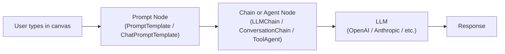
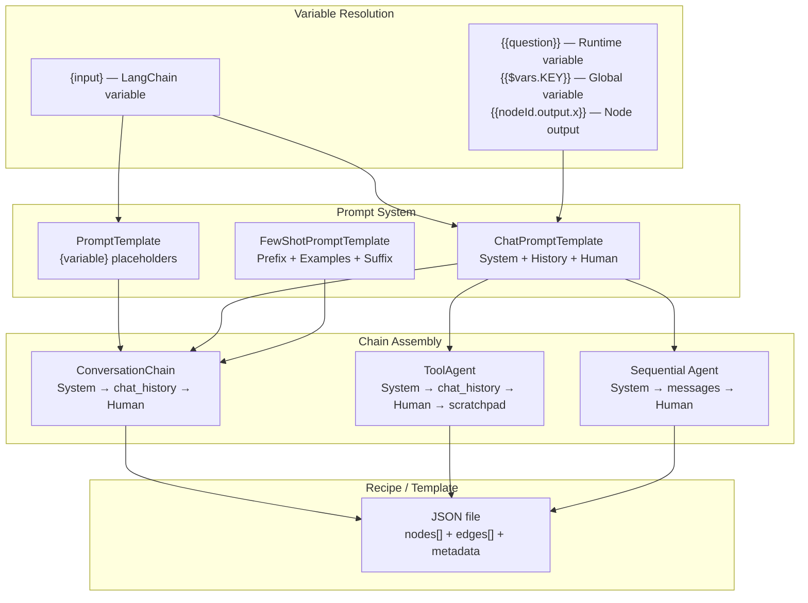

---

## 1. What Is the FlowiseAI Prompt System?

The FlowiseAI prompt system is the layer that controls **what instructions are sent to an AI language model (LLM)** before it generates a response. It is not a single file or setting — it is a pipeline of interconnected nodes that assemble, format, and inject text into the LLM at runtime.

The system is built on top of LangChain's prompt abstractions (`@langchain/core/prompts`) and is exposed to users as visual nodes on the canvas. Every prompt node ultimately produces a `BasePromptTemplate` object that a chain or agent node consumes.



---

## 2. The Three Prompt Node Types

There are three core prompt nodes, each implemented as an `INode` plugin in `packages/components/nodes/prompts/`.

### 2.1 `PromptTemplate` (Simple / LLM)

**File:** `packages/components/nodes/prompts/PromptTemplate/PromptTemplate.ts`

Used for non-chat (completion-style) LLMs. It is a single flat string with `{variable}` placeholders.

| Field | Purpose |
|---|---|
| `template` | The text string. Use `{variable_name}` to mark injection points. |
| `promptValues` | JSON key-value map to pre-fill variables statically. |

**Example template:**
```
What is a good name for a company that makes {product}?
```

The `init()` method calls `getInputVariables(template)` to extract variable names, then `transformBracesWithColon()` to escape any JSON-like `{key: value}` content that would otherwise confuse the parser. [1](#0-0) 

---

### 2.2 `ChatPromptTemplate` (Chat / Multi-turn)

**File:** `packages/components/nodes/prompts/ChatPromptTemplate/ChatPromptTemplate.ts`

This is the most important and commonly used prompt node. It structures the prompt as an **ordered list of typed messages**, which is how modern chat models (GPT-4, Claude, Gemini) expect input.

It has four configurable parts:

#### Part A: System Message (`systemMessagePrompt`)
- **Role:** Sets the AI's persona, rules, and behavioral constraints.
- **Type:** `string` (multi-line text area)
- **Rendered as:** `SystemMessagePromptTemplate`
- **Supports variables:** Yes, using `{variable}` syntax.
- **Example:** `You are a helpful assistant that translates {input_language} to {output_language}.`

#### Part B: Messages History (`messageHistoryCode`)
- **Role:** Injects few-shot examples or static conversation turns between the system message and the human message. This teaches the model by example.
- **Type:** JavaScript code executed in a sandboxed `vm2` environment.
- **Returns:** An array of `HumanMessage`, `AIMessage`, or `ToolMessage` objects.
- **Position in prompt:** Inserted between the System Message and the Human Message.
- **Example code:**
```js
const { AIMessage, HumanMessage } = require('@langchain/core/messages');
return [
    new HumanMessage("What is 2+2?"),
    new AIMessage("4"),
]
``` [2](#0-1) 

#### Part C: Human Message (`humanMessagePrompt`)
- **Role:** The template for the user's actual input. This is appended last.
- **Type:** `string`
- **Rendered as:** `HumanMessagePromptTemplate`
- **Default:** `{text}` or `{input}` — a single variable that receives the user's chat message at runtime.
- **Note:** This is described in the UI as "added at the end of the messages as human message." [3](#0-2) 

#### Part D: Format Prompt Values (`promptValues`)
- **Role:** A JSON key-value map that statically pre-fills variables declared in the System or Human messages. Accepts `{{variable}}` references to other nodes' outputs.
- **Type:** `json` (list of key-value pairs)
- **Example:** `{ "input_language": "French", "output_language": "English" }` [4](#0-3) 

**Final assembled message order:**
```
[SystemMessage] → [MessageHistory (optional)] → [MessagesPlaceholder(chat_history)] → [HumanMessage]
``` [5](#0-4) 

---

### 2.3 `FewShotPromptTemplate` (Example-Driven)

**File:** `packages/components/nodes/prompts/FewShotPromptTemplate/FewShotPromptTemplate.ts`

Used when you want to teach the model a pattern through multiple input/output examples. It is composed of five parts:

| Field | Role |
|---|---|
| `prefix` | Instructions placed before the examples. |
| `examples` | JSON array of example objects, e.g. `[{"word": "happy", "antonym": "sad"}]` |
| `examplePrompt` | A `PromptTemplate` node that formats each example. |
| `suffix` | The actual query template placed after the examples, e.g. `Word: {input}\nAntonym:` |
| `exampleSeparator` | String placed between examples, default `\n\n`. | [6](#0-5) 

---

## 3. The Variable Resolution System

Variables are the mechanism for injecting dynamic runtime data into prompt text. There are **two syntaxes** that serve different purposes:

### 3.1 LangChain Template Variables: `{variable}`
Used inside `PromptTemplate` and `ChatPromptTemplate` text fields. These are resolved by LangChain at chain invocation time. The `transformBracesWithColon()` utility escapes any `{key: value}` JSON-like content to `{{key: value}}` to prevent false positives. [7](#0-6) 

### 3.2 Flowise Runtime Variables: `{{variable}}`
Used in `promptValues`, node input fields, and the Agentflow `RichInput` editor. These are resolved by the server **before** the node is initialized, by the `resolveVariables()` function in `buildChatflow.ts` / `buildAgentflow.ts`.

| Variable | Resolves To |
|---|---|
| `{{question}}` | The user's current chat message |
| `{{chat_history}}` | Serialized conversation history |
| `{{file_attachment}}` | Uploaded file content |
| `{{$vars.MY_KEY}}` | A global variable from the Variables table |
| `{{$flow.sessionId}}` | Current session ID |
| `{{$flow.chatId}}` | Current chat ID |
| `{{nodeId.output.path}}` | Output of a previously executed node |
| `{{$iteration}}` | Current item in a loop/iteration node |
| `{{$form.fieldName}}` | Value from an Agentflow form input |
| `{{$webhook.body.id}}` | Value from an incoming webhook payload |

---

## 4. How Prompts Are Assembled in Chains and Agents

Different chain/agent nodes assemble the prompt messages in specific orders:

**ConversationChain:**
```
[System] → [MessagesPlaceholder: chat_history] → [Human: {input}]
``` [8](#0-7) 

**ToolAgent:**
```
[System] → [MessagesPlaceholder: chat_history] → [Human: {input}] → [MessagesPlaceholder: agent_scratchpad]
``` [9](#0-8) 

**Sequential Agent / LLM Node:**
```
[System (optional)] → [MessagesPlaceholder: messages] → [Human (optional)]
``` [10](#0-9) 

---

## 5. Optimal Word Count for Prompts

There is no single universal word count. The codebase does not enforce a limit at the prompt node level — limits are enforced by the LLM's **context window** (measured in tokens, not words). Guidelines based on the system's design:

| Prompt Section | Recommended Length | Rationale |
|---|---|---|
| **System Message** | 50–300 words | Concise persona + rules. Longer = more tokens consumed per turn. |
| **Few-Shot Examples** | 2–5 examples | Each example costs tokens. More examples = better accuracy but higher cost. |
| **Human Message Template** | 1–3 sentences | Usually just `{input}` or a short framing sentence. |
| **Total prompt** | < 20% of model's context window | Leaves room for conversation history and the model's response. |

For a model with a 128K token context window (e.g., GPT-4o), a system prompt of 500 words (~700 tokens) is well within budget. For a 4K context model (e.g., older GPT-3.5), keep the system prompt under 100 words.

The `DEFAULT_SUMMARIZER_TEMPLATE` in the codebase demonstrates the platform's own internal prompt style: concise, example-driven, with a clear output format instruction. [11](#0-10) 

---

## 6. Recipe Template

A **recipe** in FlowiseAI is a JSON file that fully describes a flow. It is the format used by the Marketplace and the Export/Import system. The server reads these from `packages/server/marketplaces/chatflows/` and `packages/server/marketplaces/agentflowsv2/`. [12](#0-11) 

### 6.1 Recipe JSON Schema

```json
{
  "description": "One-sentence description of what this flow does.",
  "usecases": ["Customer Support", "RAG", "Summarization"],
  "framework": "Langchain",
  "badge": "POPULAR",
  "nodes": [ /* array of node objects */ ],
  "edges": [ /* array of edge objects */ ]
}
```

### 6.2 Node Object Schema

Each node in the `nodes` array follows this structure (derived from `_generateExportFlowData`): [13](#0-12) 

```json
{
  "id": "chatPromptTemplate_0",
  "type": "customNode",
  "position": { "x": 100, "y": 200 },
  "data": {
    "id": "chatPromptTemplate_0",
    "label": "Chat Prompt Template",
    "version": 2,
    "name": "chatPromptTemplate",
    "type": "ChatPromptTemplate",
    "category": "Prompts",
    "description": "Schema to represent a chat prompt",
    "baseClasses": ["ChatPromptTemplate", "BaseChatPromptTemplate", "BasePromptTemplate", "Runnable"],
    "inputParams": [ /* parameter definitions */ ],
    "inputAnchors": [ /* connection input ports */ ],
    "inputs": {
      "systemMessagePrompt": "You are a helpful assistant.",
      "humanMessagePrompt": "{input}",
      "promptValues": ""
    },
    "outputAnchors": [ /* connection output ports */ ],
    "outputs": {}
  }
}
```

### 6.3 Edge Object Schema

```json
{
  "id": "edge_0",
  "source": "chatPromptTemplate_0",
  "sourceHandle": "chatPromptTemplate_0-output-chatPromptTemplate-ChatPromptTemplate|...",
  "target": "conversationChain_0",
  "targetHandle": "conversationChain_0-input-chatPromptTemplate-ChatPromptTemplate",
  "type": "buttonedge",
  "data": { "label": "" }
}
``` [14](#0-13) 

---

### 6.4 Complete Minimal Recipe: Customer Support Chatbot

This is a ready-to-use recipe for a simple customer support chatbot using a `ChatPromptTemplate` → `ConversationChain` → `ChatOpenAI` topology.

```json
{
  "description": "A customer support chatbot with a custom system persona and conversation memory.",
  "usecases": ["Customer Support", "Chatbot"],
  "framework": "Langchain",
  "badge": "NEW",
  "nodes": [
    {
      "id": "chatOpenAI_0",
      "type": "customNode",
      "position": { "x": 900, "y": 200 },
      "data": {
        "id": "chatOpenAI_0",
        "label": "ChatOpenAI",
        "version": 6,
        "name": "chatOpenAI",
        "type": "ChatOpenAI",
        "category": "Chat Models",
        "baseClasses": ["ChatOpenAI", "BaseChatModel"],
        "credential": {
          "label": "Connect Credential",
          "name": "credential",
          "type": "credential",
          "credentialNames": ["openAIApi"]
        },
        "inputParams": [
          { "label": "Model Name", "name": "modelName", "type": "string" },
          { "label": "Temperature", "name": "temperature", "type": "number", "default": 0.9 }
        ],
        "inputAnchors": [],
        "inputs": {
          "modelName": "gpt-4o-mini",
          "temperature": 0.7
        },
        "outputAnchors": [
          {
            "id": "chatOpenAI_0-output-chatOpenAI-ChatOpenAI|BaseChatModel",
            "name": "chatOpenAI",
            "label": "ChatOpenAI",
            "type": "ChatOpenAI | BaseChatModel"
          }
        ],
        "outputs": {}
      }
    },
    {
      "id": "chatPromptTemplate_0",
      "type": "customNode",
      "position": { "x": 100, "y": 200 },
      "data": {
        "id": "chatPromptTemplate_0",
        "label": "Chat Prompt Template",
        "version": 2,
        "name": "chatPromptTemplate",
        "type": "ChatPromptTemplate",
        "category": "Prompts",
        "baseClasses": ["ChatPromptTemplate", "BaseChatPromptTemplate", "BasePromptTemplate", "Runnable"],
        "inputParams": [
          { "label": "System Message", "name": "systemMessagePrompt", "type": "string", "rows": 4 },
          { "label": "Human Message", "name": "humanMessagePrompt", "type": "string", "rows": 4 },
          { "label": "Format Prompt Values", "name": "promptValues", "type": "json", "optional": true }
        ],
        "inputAnchors": [],
        "inputs": {
          "systemMessagePrompt": "You are a friendly and knowledgeable customer support agent for Acme Corp. Your job is to help users with product questions, order issues, and returns. Always be polite, concise, and escalate to a human agent if you cannot resolve the issue. Do not discuss topics unrelated to Acme Corp products.",
          "humanMessagePrompt": "{input}",
          "promptValues": ""
        },
        "outputAnchors": [
          {
            "id": "chatPromptTemplate_0-output-chatPromptTemplate-ChatPromptTemplate|BaseChatPromptTemplate|BasePromptTemplate|Runnable",
            "name": "chatPromptTemplate",
            "label": "ChatPromptTemplate",
            "type": "ChatPromptTemplate | BaseChatPromptTemplate | BasePromptTemplate | Runnable"
          }
        ],
        "outputs": {}
      }
    },
    {
      "id": "bufferMemory_0",
      "type": "customNode",
      "position": { "x": 100, "y": 500 },
      "data": {
        "id": "bufferMemory_0",
        "label": "Buffer Memory",
        "version": 2,
        "name": "bufferMemory",
        "type": "BufferMemory",
        "category": "Memory",
        "baseClasses": ["BufferMemory", "FlowiseMemory"],
        "inputParams": [
          { "label": "Memory Key", "name": "memoryKey", "type": "string", "default": "chat_history" },
          { "label": "Input Key", "name": "inputKey", "type": "string", "default": "input" }
        ],
        "inputAnchors": [],
        "inputs": {
          "memoryKey": "chat_history",
          "inputKey": "input"
        },
        "outputAnchors": [
          {
            "id": "bufferMemory_0-output-bufferMemory-BufferMemory|FlowiseMemory",
            "name": "bufferMemory",
            "label": "BufferMemory",
            "type": "BufferMemory | FlowiseMemory"
          }
        ],
        "outputs": {}
      }
    },
    {
      "id": "conversationChain_0",
      "type": "customNode",
      "position": { "x": 500, "y": 300 },
      "data": {
        "id": "conversationChain_0",
        "label": "Conversation Chain",
        "version": 3,
        "name": "conversationChain",
        "type": "ConversationChain",
        "category": "Chains",
        "baseClasses": ["ConversationChain", "LLMChain", "BaseChain"],
        "inputParams": [],
        "inputAnchors": [
          { "label": "Chat Model", "name": "model", "type": "BaseChatModel" },
          { "label": "Memory", "name": "memory", "type": "BaseMemory" },
          { "label": "Chat Prompt Template", "name": "chatPromptTemplate", "type": "ChatPromptTemplate", "optional": true }
        ],
        "inputs": {
          "model": "chatOpenAI_0",
          "memory": "bufferMemory_0",
          "chatPromptTemplate": "chatPromptTemplate_0"
        },
        "outputAnchors": [
          {
            "id": "conversationChain_0-output-conversationChain-ConversationChain|LLMChain|BaseChain",
            "name": "conversationChain",
            "label": "ConversationChain",
            "type": "ConversationChain | LLMChain | BaseChain"
          }
        ],
        "outputs": {}
      }
    }
  ],
  "edges": [
    {
      "id": "edge_prompt_to_chain",
      "source": "chatPromptTemplate_0",
      "sourceHandle": "chatPromptTemplate_0-output-chatPromptTemplate-ChatPromptTemplate|BaseChatPromptTemplate|BasePromptTemplate|Runnable",
      "target": "conversationChain_0",
      "targetHandle": "conversationChain_0-input-chatPromptTemplate-ChatPromptTemplate",
      "type": "buttonedge",
      "data": { "label": "" }
    },
    {
      "id": "edge_model_to_chain",
      "source": "chatOpenAI_0",
      "sourceHandle": "chatOpenAI_0-output-chatOpenAI-ChatOpenAI|BaseChatModel",
      "target": "conversationChain_0",
      "targetHandle": "conversationChain_0-input-model-BaseChatModel",
      "type": "buttonedge",
      "data": { "label": "" }
    },
    {
      "id": "edge_memory_to_chain",
      "source": "bufferMemory_0",
      "sourceHandle": "bufferMemory_0-output-bufferMemory-BufferMemory|FlowiseMemory",
      "target": "conversationChain_0",
      "targetHandle": "conversationChain_0-input-memory-BaseMemory",
      "type": "buttonedge",
      "data": { "label": "" }
    }
  ]
}
```

---

## 7. Step-by-Step Instructions to Create or Reproduce a Flow

### Using the Visual Canvas

1. **Open Flowise** → click **Chatflows** → **Add New**.
2. **Add a Chat Model node**: drag `ChatOpenAI` (or any provider) onto the canvas. Connect your API credential.
3. **Add a Memory node**: drag `Buffer Memory`. Set `memoryKey` to `chat_history` and `inputKey` to `input`.
4. **Add a Chat Prompt Template node**: drag `Chat Prompt Template`. Fill in:
   - **System Message**: your persona/rules text.
   - **Human Message**: `{input}` (leave as default).
5. **Add a Conversation Chain node**: drag `Conversation Chain`. Connect:
   - `ChatOpenAI` output → `model` input
   - `Buffer Memory` output → `memory` input
   - `Chat Prompt Template` output → `chatPromptTemplate` input
6. **Save** and click **Deploy** to get a public API endpoint.

### Using a Recipe JSON File

1. Save the JSON above as `my-recipe.json`.
2. In Flowise, go to **Chatflows** → click the **Import** icon (upload arrow).
3. Select `my-recipe.json`. The canvas loads with all nodes pre-positioned.
4. Click each node that requires a credential (e.g., `ChatOpenAI`) and connect your API key.
5. Save and deploy.

### Publishing to the Marketplace

Place the JSON file in `packages/server/marketplaces/chatflows/` (for Chatflows) or `packages/server/marketplaces/agentflowsv2/` (for Agentflows). The `getAllTemplates()` service function reads all `.json` files from these directories at runtime. [15](#0-14) 

---

## Summary Diagram



### Citations

**File:** packages/components/nodes/prompts/PromptTemplate/PromptTemplate.ts (L44-71)
```typescript
    async init(nodeData: INodeData): Promise<any> {
        let template = nodeData.inputs?.template as string
        const promptValuesStr = nodeData.inputs?.promptValues

        let promptValues: ICommonObject = {}
        if (promptValuesStr) {
            try {
                promptValues = typeof promptValuesStr === 'object' ? promptValuesStr : JSON.parse(promptValuesStr)
            } catch (exception) {
                throw new Error("Invalid JSON in the PromptTemplate's promptValues: " + exception)
            }
        }

        const inputVariables = getInputVariables(template)
        template = transformBracesWithColon(template)

        try {
            const options: PromptTemplateInput = {
                template,
                inputVariables
            }
            const prompt = new PromptTemplate(options)
            prompt.promptValues = promptValues
            return prompt
        } catch (e) {
            throw new Error(e)
        }
    }
```

**File:** packages/components/nodes/prompts/ChatPromptTemplate/ChatPromptTemplate.ts (L51-96)
```typescript
        this.inputs = [
            {
                label: 'System Message',
                name: 'systemMessagePrompt',
                type: 'string',
                rows: 4,
                placeholder: `You are a helpful assistant that translates {input_language} to {output_language}.`
            },
            {
                label: 'Human Message',
                name: 'humanMessagePrompt',
                description: 'This prompt will be added at the end of the messages as human message',
                type: 'string',
                rows: 4,
                placeholder: `{text}`
            },
            {
                label: 'Format Prompt Values',
                name: 'promptValues',
                type: 'json',
                optional: true,
                acceptVariable: true,
                list: true
            },
            {
                label: 'Messages History',
                name: 'messageHistory',
                description: 'Add messages after System Message. This is useful when you want to provide few shot examples',
                type: 'tabs',
                tabIdentifier: TAB_IDENTIFIER,
                additionalParams: true,
                default: 'messageHistoryCode',
                tabs: [
                    //TODO: add UI for messageHistory
                    {
                        label: 'Add Messages (Code)',
                        name: 'messageHistoryCode',
                        type: 'code',
                        hideCodeExecute: true,
                        codeExample: defaultFunc,
                        optional: true,
                        additionalParams: true
                    }
                ]
            }
        ]
```

**File:** packages/components/nodes/prompts/ChatPromptTemplate/ChatPromptTemplate.ts (L116-148)
```typescript
        if (
            (messageHistory && messageHistory === 'messageHistoryCode' && messageHistoryCode) ||
            (selectedTab === 'messageHistoryCode' && messageHistoryCode)
        ) {
            const appDataSource = options.appDataSource as DataSource
            const databaseEntities = options.databaseEntities as IDatabaseEntity
            const variables = await getVars(appDataSource, databaseEntities, nodeData, options)
            const flow = {
                chatflowId: options.chatflowid,
                sessionId: options.sessionId,
                chatId: options.chatId
            }

            const sandbox = createCodeExecutionSandbox('', variables, flow)

            try {
                const response = await executeJavaScriptCode(messageHistoryCode, sandbox, {
                    libraries: ['axios', '@langchain/core']
                })

                const parsedResponse = JSON.parse(response)

                if (!Array.isArray(parsedResponse)) {
                    throw new Error('Returned message history must be an array')
                }
                prompt = ChatPromptTemplate.fromMessages([
                    SystemMessagePromptTemplate.fromTemplate(systemMessagePrompt),
                    ...parsedResponse,
                    HumanMessagePromptTemplate.fromTemplate(humanMessagePrompt)
                ])
            } catch (e) {
                throw new Error(e)
            }
```

**File:** packages/components/nodes/chains/ConversationChain/ConversationChain.ts (L176-210)
```typescript
    if (chatPromptTemplate && chatPromptTemplate.promptMessages.length) {
        const sysPrompt = chatPromptTemplate.promptMessages[0]
        const humanPrompt = chatPromptTemplate.promptMessages[chatPromptTemplate.promptMessages.length - 1]
        const messages = [sysPrompt, new MessagesPlaceholder(memory.memoryKey ?? 'chat_history'), humanPrompt]

        // OpenAI works better when separate images into standalone human messages
        if (model instanceof ChatOpenAI && humanImageMessages.length) {
            messages.push(new HumanMessage({ content: [...humanImageMessages] }))
        } else if (humanImageMessages.length) {
            const lastMessage = messages.pop() as HumanMessagePromptTemplate
            const template = (lastMessage.prompt as PromptTemplate).template as string
            const msg = HumanMessagePromptTemplate.fromTemplate([
                ...humanImageMessages,
                {
                    text: template
                }
            ])
            msg.inputVariables = lastMessage.inputVariables
            messages.push(msg)
        }

        const chatPrompt = ChatPromptTemplate.fromMessages(messages)
        if ((chatPromptTemplate as any).promptValues) {
            // @ts-ignore
            chatPrompt.promptValues = (chatPromptTemplate as any).promptValues
        }

        return chatPrompt
    }

    const messages: BaseMessagePromptTemplateLike[] = [
        SystemMessagePromptTemplate.fromTemplate(prompt ? prompt : systemMessage),
        new MessagesPlaceholder(memory.memoryKey ?? 'chat_history'),
        HumanMessagePromptTemplate.fromTemplate(`{${inputKey}}`)
    ]
```

**File:** packages/components/nodes/prompts/FewShotPromptTemplate/FewShotPromptTemplate.ts (L81-115)
```typescript
    async init(nodeData: INodeData): Promise<any> {
        const examplesStr = nodeData.inputs?.examples
        const prefix = nodeData.inputs?.prefix as string
        const suffix = nodeData.inputs?.suffix as string
        const exampleSeparator = nodeData.inputs?.exampleSeparator as string
        const templateFormat = nodeData.inputs?.templateFormat as TemplateFormat
        const examplePrompt = nodeData.inputs?.examplePrompt as PromptTemplate

        const inputVariables = [...new Set([...getInputVariables(suffix), ...getInputVariables(prefix)])]

        let examples: Example[] = []
        if (examplesStr) {
            try {
                examples = typeof examplesStr === 'object' ? examplesStr : JSON.parse(examplesStr)
            } catch (exception) {
                throw new Error("Invalid JSON in the FewShotPromptTemplate's examples: " + exception)
            }
        }

        try {
            const obj: FewShotPromptTemplateInput = {
                examples,
                examplePrompt,
                prefix,
                suffix,
                inputVariables,
                exampleSeparator,
                templateFormat
            }
            const prompt = new FewShotPromptTemplate(obj)
            return prompt
        } catch (e) {
            throw new Error(e)
        }
    }
```

**File:** packages/components/src/utils.ts (L275-295)
```typescript
export const transformBracesWithColon = (input: string): string => {
    // This regex uses negative lookbehind (?<!{) and negative lookahead (?!})
    // to ensure we only match single curly braces, not double ones.
    // It will match a single { that's not preceded by another {,
    // followed by any content without braces, then a single } that's not followed by another }.
    const regex = /(?<!\{)\{([^{}]*?)\}(?!\})/g

    return input.replace(regex, (match, groupContent) => {
        // groupContent is the text inside the braces `{ ... }`.

        if (groupContent.includes(':')) {
            // If there's a colon in the content, we turn { ... } into {{ ... }}
            // The match is the full string like: "{ answer: hello }"
            // groupContent is the inner part like: " answer: hello "
            return `{{${groupContent}}}`
        } else {
            // Otherwise, leave it as is
            return match
        }
    })
}
```

**File:** packages/components/nodes/agents/ToolAgent/ToolAgent.ts (L276-281)
```typescript
    let prompt = ChatPromptTemplate.fromMessages([
        ['system', systemMessage],
        new MessagesPlaceholder(memoryKey),
        ['human', `{${inputKey}}`],
        new MessagesPlaceholder('agent_scratchpad')
    ])
```

**File:** packages/components/nodes/sequentialagents/LLMNode/LLMNode.ts (L524-529)
```typescript
    const promptArrays = [new MessagesPlaceholder('messages')] as BaseMessagePromptTemplateLike[]
    if (systemPrompt) promptArrays.unshift(['system', systemPrompt])
    if (humanPrompt) promptArrays.push(['human', humanPrompt])

    let prompt = ChatPromptTemplate.fromMessages(promptArrays)
    prompt = await checkMessageHistory(nodeData, options, prompt, promptArrays, systemPrompt)
```

**File:** packages/components/nodes/agentflow/prompt.ts (L1-14)
```typescript
export const DEFAULT_SUMMARIZER_TEMPLATE = `Progressively summarize the conversation provided and return a new summary.

EXAMPLE:
Human: Why do you think artificial intelligence is a force for good?
AI: Because artificial intelligence will help humans reach their full potential.

New summary:
The human asks what the AI thinks of artificial intelligence. The AI thinks artificial intelligence is a force for good because it will help humans reach their full potential.
END OF EXAMPLE

Conversation:
{conversation}

New summary:`
```

**File:** packages/server/src/services/marketplaces/index.ts (L16-23)
```typescript
type ITemplate = {
    badge: string
    description: string
    framework: string[]
    usecases: string[]
    nodes: IReactFlowNode[]
    edges: IReactFlowEdge[]
}
```

**File:** packages/server/src/services/marketplaces/index.ts (L30-52)
```typescript
const getAllTemplates = async () => {
    try {
        let marketplaceDir = path.join(__dirname, '..', '..', '..', 'marketplaces', 'chatflows')
        let jsonsInDir = fs.readdirSync(marketplaceDir).filter((file) => path.extname(file) === '.json')
        let templates: any[] = []
        jsonsInDir.forEach((file) => {
            const filePath = path.join(__dirname, '..', '..', '..', 'marketplaces', 'chatflows', file)
            const fileData = fs.readFileSync(filePath)
            const fileDataObj = JSON.parse(fileData.toString()) as ITemplate

            const template = {
                id: uuidv4(),
                templateName: file.split('.json')[0],
                flowData: fileData.toString(),
                badge: fileDataObj?.badge,
                framework: fileDataObj?.framework,
                usecases: fileDataObj?.usecases,
                categories: getCategories(fileDataObj),
                type: 'Chatflow',
                description: fileDataObj?.description || ''
            }
            templates.push(template)
        })
```

**File:** packages/server/src/services/marketplaces/index.ts (L256-296)
```typescript
        const newNodeData = {
            id: node.data.id,
            label: node.data.label,
            version: node.data.version,
            name: node.data.name,
            type: node.data.type,
            color: node.data.color,
            hideOutput: node.data.hideOutput,
            hideInput: node.data.hideInput,
            baseClasses: node.data.baseClasses,
            tags: node.data.tags,
            category: node.data.category,
            description: node.data.description,
            inputParams: node.data.inputParams,
            inputAnchors: node.data.inputAnchors,
            inputs: {},
            outputAnchors: node.data.outputAnchors,
            outputs: node.data.outputs,
            selected: false
        }

        if (node.data.tags && node.data.tags.length) {
            if (node.data.tags.includes('LlamaIndex')) {
                framework = 'LlamaIndex'
            }
        }

        // Remove password, file & folder
        if (node.data.inputs && Object.keys(node.data.inputs).length) {
            const nodeDataInputs: any = {}
            for (const input in node.data.inputs) {
                const inputParam = node.data.inputParams.find((inp: any) => inp.name === input)
                if (inputParam && inputParam.type === 'password') continue
                if (inputParam && inputParam.type === 'file') continue
                if (inputParam && inputParam.type === 'folder') continue
                nodeDataInputs[input] = node.data.inputs[input]
            }
            newNodeData.inputs = nodeDataInputs
        }

        nodes[i].data = newNodeData
```

**File:** packages/server/src/Interface.ts (L309-329)
```typescript
export interface IReactFlowEdge {
    source: string
    sourceHandle: string
    target: string
    targetHandle: string
    type: string
    id: string
    data: {
        label: string
    }
}

export interface IReactFlowObject {
    nodes: IReactFlowNode[]
    edges: IReactFlowEdge[]
    viewport: {
        x: number
        y: number
        zoom: number
    }
}
```
